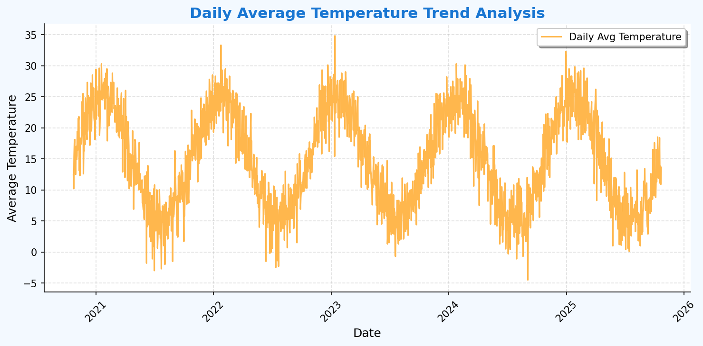
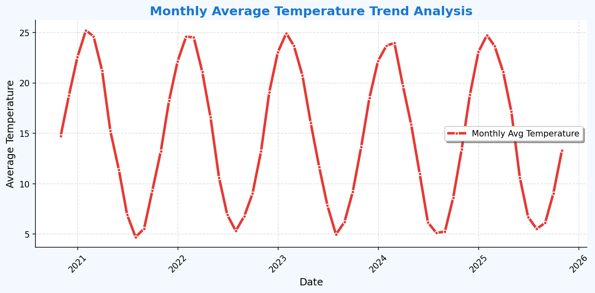
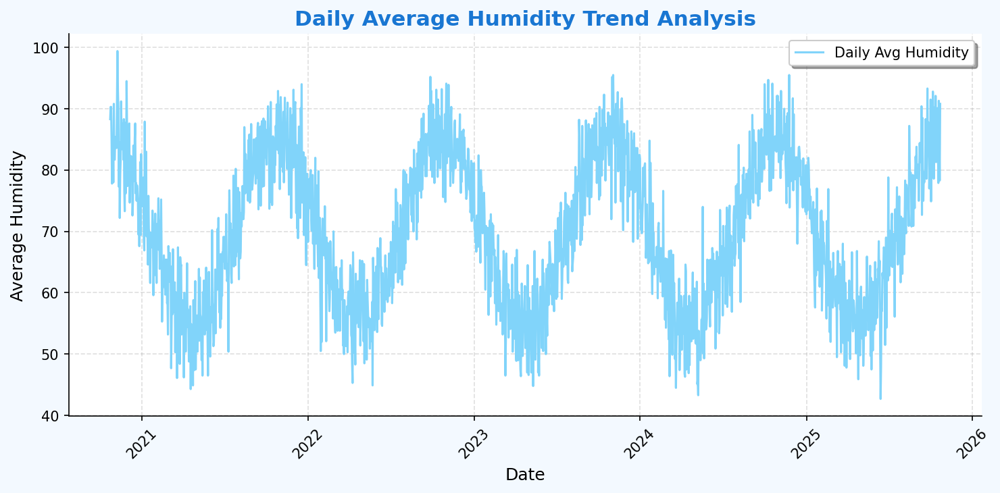
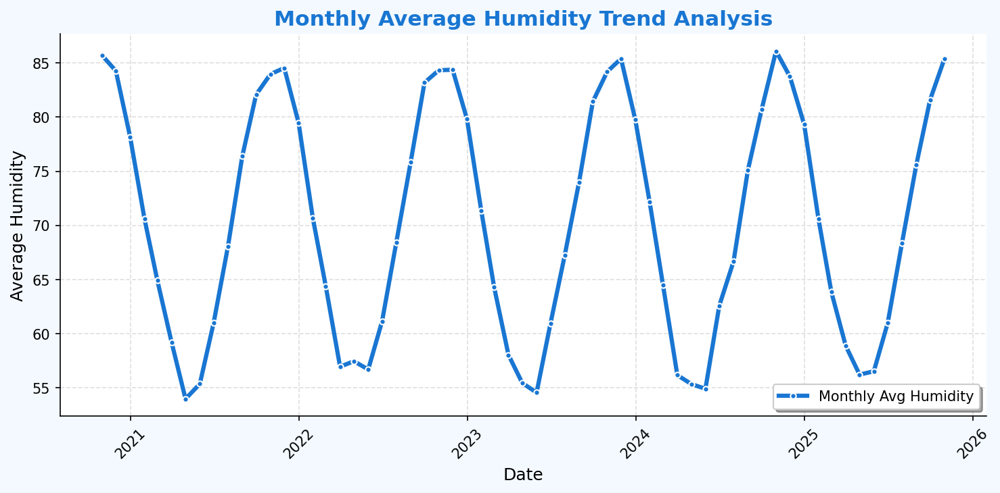

---
# Data Summary
- Total Records Analyzed: 1826
- Dataset Range: 2020-10-23 to 2025-10-22
- Overall Mean Temp: 14.83 °C
- Overall Mean Humidity: 69.99 %
---

# Comprehensive Time-Series Analysis Report
Reference Date: 2025-10-22

## Last 7 Days (Week) (from 2025-10-15)
- 🌡️ Avg Temperature: 13.56 °C (Min: 10.9 | Max: 18.4)
- 💧 Avg Humidity: 85.28 % (Min: 77.9 | Max: 91.3)

## Last 30 Days (Month) (from 2025-09-22)
- 🌡️ Avg Temperature: 12.75 °C (Min: 8.5 | Max: 18.5)
- 💧 Avg Humidity: 84.80 % (Min: 74.9 | Max: 93.3)

## Last Year (from 2024-10-22)
- 🌡️ Avg Temperature: 15.02 °C (Min: 0.1 | Max: 32.3)
- 💧 Avg Humidity: 70.19 % (Min: 42.7 | Max: 95.5)

## Last Decade (from 2015-10-22)
- 🌡️ Avg Temperature: 14.83 °C (Min: -4.5 | Max: 34.8)
- 💧 Avg Humidity: 69.99 % (Min: 42.7 | Max: 99.4)

---
## Visualization: Daily Average Temperature Trend Analysis Plot

---
## Visualization: Monthly Average Temperature Trend Analysis Plot

---
## Visualization: Daily Average Humidity Trend Analysis Plot

---
## Visualization: Monthly Average Humidity Trend Analysis Plot

